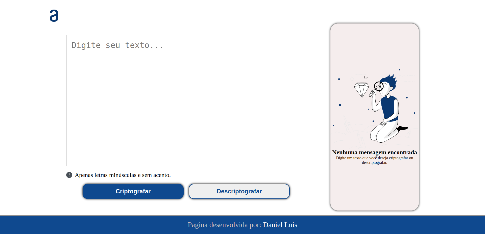

<!--## Decodificador de texto
Desafio decodificador de texto alura-->

<h1 align="center">Decodificador de texto</h1>

 
 

# Descrição
Pagina web para criptografar ou descriptografar textos.

# Versão
1.0.0

# Tecnologias usadas
* HTML
* CSS
* JAVASCRIPT

# Resumo
Neste projeto usei varias formas diferentes de fazer as coisas, tentei usar algoritimos diferentes.

EXEMPLO:
Antes do texto ser codificado, é feito uma validação do texto de duas formas diferentes, uma é usando regex.